# Case and Session Concepts in FaultMaven

**Version:** 2.0  
**Date:** 2025-10-11  
**Status:** Authoritative Specification  
**Purpose:** Define foundational concepts that both frontend and backend must understand identically

---

## Overview

This document establishes the **authoritative definitions** for the core concepts in FaultMaven's architecture: **User**, **Client**, **Session**, and **Case**. These concepts are foundational to the system's design and **must be understood identically by both frontend and backend teams** to prevent architectural violations and API contract issues.

This document reflects the proper architectural design where:
- **Cases** are **top-level resources** (permanent, independent)
- **Sessions** are used **only for authentication** (temporary, client-based)
- **Clients** enable multi-device and session resumption
- **Users** directly own cases (not via sessions)

---

## Core Concepts (4-Concept Model)

### 1. User

**Definition**: A person who uses FaultMaven for troubleshooting

**Characteristics**:
- **Identifier**: `user_id` (string, UUID)
- **Persistence**: Permanent entity in the system
- **Ownership**: Users **directly own** cases (not through sessions)
- **Multi-Device**: Can authenticate from multiple clients simultaneously

**Relationships**:
- User → owns → Cases (direct ownership)
- User → authenticates via → Clients (device/browser instances)

---

### 2. Client

**Definition**: A specific device/browser instance from which a user accesses FaultMaven

**Characteristics**:
- **Identifier**: `client_id` (UUID v4, persisted in localStorage)
- **Persistence**: Persists across browser sessions via localStorage
- **Purpose**: Enables session resumption and multi-device support
- **Generation**: Created once per browser/device, stored permanently

**Examples**:
- User's work laptop browser (Chrome)
- User's personal desktop browser (Firefox)
- User's mobile device browser (Safari)
- User's tablet browser

**Frontend Implementation**:
```typescript
// Generate and persist client ID
function getOrCreateClientId(): string {
  let clientId = localStorage.getItem('faultmaven_client_id');
  if (!clientId) {
    clientId = crypto.randomUUID();
    localStorage.setItem('faultmaven_client_id', clientId);
  }
  return clientId;
}
```

---

### 3. Session

**Definition**: An authenticated connection between a specific user and client

**Characteristics**:
- **Identifier**: `session_id` (UUID v4)
- **Formula**: `Session = User + Client + Authentication Context`
- **Purpose**: Provides authentication and temporary state management
- **Lifecycle**: Temporary (configurable TTL, typically 30 minutes to 24 hours)
- **Scope**: **Multiple concurrent sessions per user** (one per client/device)
- **Persistence**: Redis-backed with multi-index: (user_id, client_id) → session_id

**Session Resumption**:
- Same `client_id` can resume sessions across browser restarts
- Redis lookup: (user_id, client_id) → existing session_id
- Seamless user experience without re-login

**Multi-Session Support**:
- Each user can maintain multiple active sessions simultaneously
- Each client/device gets independent session
- Sessions isolated from each other
- All sessions access same user's cases

**Contains**:
- User authentication state
- Session creation/expiry timestamps 
- User identity information
- Client identification for resumption
- Session resumption status and metadata
- Multi-device session tracking

**Does NOT Contain**:
- ❌ Cases (cases are independent resources)
- ❌ Case history (cases manage their own history)  
- ❌ Current active case ID (frontend UI state)
- ❌ Other users' session data (strict isolation)
- ❌ Cross-client session data (each client maintains independent session)

---

### 4. Case

**Definition**: A persistent troubleshooting investigation with complete conversation history

**Characteristics**:
- **Identifier**: `case_id` (UUID v4)
- **Purpose**: Long-term investigation tracking and conversation persistence
- **Lifecycle**: Permanent (30+ days, until explicitly deleted or archived)
- **Ownership**: Directly owned by users (`case.owner_id = user_id`)
- **Scope**: Single troubleshooting investigation (independent of sessions)
- **Persistence**: Independent database storage (not tied to session lifecycle)

**Contains**:
- Complete conversation history (query/response pairs)
- Case metadata (title, status, priority, timestamps)
- Investigation findings and recommendations
- Uploaded data specific to this case
- User who created the case (for authorization)
- Complete audit trail

**Does NOT Contain**:
- ❌ Session binding (session_id references)
- ❌ Client-specific data
- ❌ Temporary state (goes in session or frontend)

---

## Relationships

### Direct Relationships

```mermaid
graph TB
    User[👤 User] -->|owns| Case[📁 Case]
    User[👤 User] -->|authenticates via| Client[💻 Client]
    Client[💻 Client] -->|creates| Session[🔒 Session]

    classDef user fill:#e3f2fd
    classDef client fill:#f3e5f5
    classDef session fill:#e8f5e8
    classDef case fill:#fff3e0

    class User user
    class Client client
    class Session session
    class Case case
```



**Relationship Details**:

1. **User ↔ Case**: Direct ownership
   - `case.owner_id = user_id`
   - One user can have multiple cases
   - Cases persist beyond session lifecycle
   - Cases accessible from all user's sessions

2. **User ↔ Client**: Multi-device authentication
   - `(user_id, client_id)` combination is unique
   - Multiple clients per user supported (multi-device)
   - Client persists across browser restarts (localStorage)

3. **Client ↔ Session**: Session creation
   - `session = f(user_id, client_id, auth_context)`
   - One active session per (user, client) pair
   - Session provides authentication context
   - Session resumption via (user_id, client_id) lookup

### Indirect Relationships

```mermaid
graph TB
    Session[🔒 Session] -.->|authenticates| User[👤 User]
    User[👤 User] -->|owns| Case[📁 Case]
    Session[🔒 Session] -.->|can access| Case[📁 Case]

    classDef direct stroke:#2196F3,stroke-width:3px
    classDef indirect stroke:#FF9800,stroke-width:2px,stroke-dasharray: 5 5

    class User,Case direct
    class Session indirect
```



**Session ↔ Case**: Indirect relationship through user ownership
- Sessions authenticate users
- Authenticated users can access their cases
- **Formula**: `Session → User → User's Cases`
- Authorization: `session.user_id == case.owner_id`

---

## Architecture Principles

**Key Architectural Principles**: 
- Cases are **NOT** nested under sessions. Sessions provide **authentication context only**.
- **Multiple concurrent sessions per user**: Each client/device maintains independent session
- **Session resumption**: Same client_id can resume sessions across browser restarts
- **Cross-session case access**: All user sessions can access same cases (authorization via user_id)
- **Session isolation**: Each session maintains independent authentication state
- **User-Client-Session Hierarchy**: User → Client → Session (not User → Session)

---

## Multi-Session Architecture

```mermaid
sequenceDiagram
    participant U as User
    participant L as Laptop Browser
    participant M as Mobile Browser
    participant B as Backend
    participant R as Redis

    Note over U,R: Multi-Device Session Management

    U->>L: Login from laptop
    L->>B: POST /sessions {client_id: "laptop-uuid"}
    B->>R: Store (user_id, laptop-uuid) → session_1
    B-->>L: session_1

    U->>M: Login from mobile
    M->>B: POST /sessions {client_id: "mobile-uuid"}
    B->>R: Store (user_id, mobile-uuid) → session_2
    B-->>M: session_2

    Note over L,M: Both sessions active simultaneously

    L->>B: GET /sessions/session_1/cases
    B->>R: session_1 → user_id → user's cases
    B-->>L: User's cases

    M->>B: GET /sessions/session_2/cases
    B->>R: session_2 → user_id → user's cases
    B-->>M: Same user's cases

    Note over U,R: Same cases accessible from both devices
```



**Multi-Session Benefits**:
- Users can work from multiple devices simultaneously
- Session expiry on one device doesn't affect others
- Cases remain accessible across all devices
- Seamless device switching

---

## Implementation Details

### Data Models

```python
class SessionContext(BaseModel):
    """Multi-session authentication - DOES NOT contain case data"""
    session_id: str                    # Unique session identifier
    user_id: str                       # User this session belongs to
    client_id: Optional[str]           # Client for session resumption
    created_at: datetime               # Session creation time
    last_activity: datetime            # Last activity timestamp
    expires_at: datetime               # Session expiration time
    session_resumed: bool = False      # Whether session was resumed
    # NO case_history, NO current_case_id - sessions are for auth only
    # Multiple concurrent sessions per user supported

class Case(BaseModel):
    """Independent case resource with complete lifecycle"""
    id: str                            # Primary key - NOT nested under sessions
    title: str                         # Generated or user-provided title
    user_id: str                       # Authorization reference (NOT FK to session)
    status: Literal["active", "investigating", "solved", "stalled", "archived"]
    priority: Literal["low", "medium", "high", "critical"]
    created_at: str                    # UTC ISO 8601 format
    last_updated: str                  # UTC ISO 8601 format
    conversation_count: int            # Number of query/response exchanges
    data_count: int                    # Number of uploaded files
    summary: str                       # Auto-generated case summary

class QueryRequest(BaseModel):
    """Query within a specific case context"""
    session_id: str                    # For authentication (NOT case ownership)
    query: str                         # User's question
    context: Optional[Dict[str, Any]] = None
    priority: Literal["low", "medium", "high", "critical"] = "medium"
    timestamp: str = Field(default_factory=lambda: datetime.utcnow().isoformat() + 'Z')
    # NOTE: case_id comes from URL path, not request body

class ViewState(BaseModel):
    """Complete frontend rendering state for a case"""
    session_id: str                    # Current authentication session
    case_id: str                       # Current case being viewed
    user_id: str                       # Authorized user
    case_title: str                    # Display title for case
    case_status: Literal["active", "investigating", "solved", "stalled", "archived"]
    running_summary: str               # AI-generated case summary
    uploaded_data: List[UploadedData]  # Files uploaded to this case
    conversation_count: int            # Number of exchanges in this case
    last_updated: str                  # When case was last modified
    can_upload_data: bool              # Whether user can upload more data
    needs_more_info: bool              # Whether case needs more information
    available_actions: List[AvailableAction]  # Next steps user can take
    progress_indicators: List[ProgressIndicator]  # Investigation progress
```

### TypeScript Interface (Frontend)

```typescript
// API Response Model (consistent across endpoints)
interface CaseAPI {
  case_id: string;
  title: string;
  status: CaseStatus;
  priority: CasePriority;
  owner_id: string;           // User who owns the case
  session_id: null;           // Always null - cases not bound to sessions
  created_at: string;         // ISO 8601 UTC
  updated_at: string;         // ISO 8601 UTC
  message_count: number;
}
```

---

## API Endpoints

### Cases as Top-Level Resources ✅ CORRECT

```python
# Authentication Session Management
POST   /api/v1/sessions/                    # Create new authentication session
GET    /api/v1/sessions/{session_id}        # Get session info (auth status only)
DELETE /api/v1/sessions/{session_id}        # End authentication session

# Case Management (Top-Level Resources)
POST   /api/v1/cases                       # Create new case (auth via X-Session-ID header)
GET    /api/v1/cases                       # List user's cases (auth via X-Session-ID header)
GET    /api/v1/cases/{case_id}             # Get specific case (auth via X-Session-ID header)
PUT    /api/v1/cases/{case_id}             # Update case metadata
DELETE /api/v1/cases/{case_id}             # Archive/delete case

# Query Processing (Case-Specific)
POST   /api/v1/cases/{case_id}/query       # Process query within specific case
GET    /api/v1/cases/{case_id}/history     # Get case conversation history

# Data Management (Case-Specific)
POST   /api/v1/cases/{case_id}/data        # Upload data to specific case
GET    /api/v1/cases/{case_id}/data        # List case data
DELETE /api/v1/cases/{case_id}/data/{data_id}  # Remove data from case

# Headers for ALL Case Operations:
# X-Session-ID: {session_id}  # Required for authentication
```

**Key REST Principles**:
- `case_id` always in URL path (resource identifier)
- `session_id` always in header (authentication context)
- Cases are **never** nested under `/sessions/{session_id}/...`

### API Consistency Requirements

Both case-access endpoints **MUST** return identical results for the same user:

```http
GET /api/v1/cases
Authorization: Bearer <token>

GET /api/v1/sessions/{session_id}/cases
Authorization: Bearer <token>
```

**Expected Behavior**:
- Both endpoints authenticate the same user
- Both return the same set of cases (owned by that user)
- Both return `session_id: null` in case objects (cases not bound to sessions)
- Both apply the same filtering, pagination, and sorting

---

## Service Layer Implementation

### SessionService

```python
class SessionService:
    """Authentication session management only"""
    
    async def create_session(self, user_id: str, client_id: Optional[str] = None) -> SessionContext:
        """Create new authentication session with TTL and client binding"""
        # Try to resume existing session for this (user, client) pair
        if client_id and user_id:
            existing_session_id = await session_store.find_by_user_and_client(
                user_id, client_id
            )
            if existing_session_id:
                return await session_store.get_session(existing_session_id)
        
        # Create new session bound to (user, client)
        session = Session(
            session_id=str(uuid4()),
            user_id=user_id,
            client_id=client_id,
            created_at=datetime.utcnow()
        )
        
        # Index by (user_id, client_id) for resumption
        if client_id:
            await session_store.create_client_index(user_id, client_id, session.session_id)
        
        return session
        
    async def validate_session(self, session_id: str) -> bool:
        """Validate session is active and not expired"""
        
    async def get_user_from_session(self, session_id: str) -> str:
        """Get user_id from valid session for authorization"""
```

### CaseService

```python
class CaseService:
    """Case management as top-level resources"""
    
    async def create_case(self, user_id: str, title: str, initial_query: Optional[str]) -> Case:
        """Create new case as independent resource"""
        
    async def get_user_cases(self, user_id: str) -> List[Case]:
        """Get all cases belonging to user"""
        
    async def get_case(self, case_id: str, user_id: str) -> Case:
        """Get specific case with authorization check"""
        # Validate: case.owner_id == user_id
        
    async def get_case_conversation_history(self, case_id: str, user_id: str) -> List[Dict]:
        """Get conversation history for case with auth check"""

    async def get_session_cases(self, session_id: str) -> List[Case]:
        """Get user's cases via session authentication"""
        # Session → User → User's Cases (indirect)
        user_id = await session_service.get_user_from_session(session_id)
        return await self.get_user_cases(user_id)
```

### AgentService

```python
class AgentService:
    async def process_case_query(
        self, 
        case_id: str, 
        user_id: str, 
        request: QueryRequest
    ) -> AgentResponse:
        """Process query within specific case context"""
        # 1. Validate case authorization (case.user_id == user_id)
        # 2. Retrieve conversation history from case record
        # 3. Inject history into LLM prompt for context
        # 4. Process query with full conversation context
        # 5. Record query/response in case conversation history
        # 6. Return complete ViewState for frontend rendering
```

---

## Correct Usage Patterns ✅

### Pattern 1: Multi-Session Support

```python
# CORRECT: Multi-session support with client binding
async def create_session(user_id: str, client_id: str) -> Session:
    # Check for existing session for this (user, client) pair
    existing = await session_store.find_by_user_and_client(user_id, client_id)
    if existing:
        return await session_store.get_session(existing)  # Resume

    # Create new session for this specific client
    return await session_store.create_session(user_id, client_id)
```

### Pattern 2: Proper Case Architecture

```python
# CORRECT: Cases owned by users, accessed via session authentication
class Case:
    case_id: str
    title: str
    owner_id: str                   # ✅ Direct user ownership
    # No session-binding fields     # ✅ Clean architecture

# CORRECT: Session-based case access (indirect via user)
async def get_user_cases_via_session(session_id: str) -> List[Case]:
    user_id = await session_store.get_user_id(session_id)  # Session → User
    return await case_store.get_cases_by_owner(user_id)    # User → Cases
```

### Pattern 3: Proper Frontend Integration

```typescript
// CORRECT: Client-based session management
class FaultMavenClient {
  private clientId = this.getOrCreateClientId();

  async createSession(): Promise<Session> {
    const response = await fetch('/api/v1/sessions', {
      method: 'POST',
      body: JSON.stringify({
        client_id: this.clientId  // ✅ Enable session resumption
      })
    });

    const session = await response.json();
    if (session.session_resumed) {
      console.log('Resumed existing session');  // ✅ Handle resumption
    }
    return session;
  }

  async getUserCases(): Promise<Case[]> {
    // Both endpoints return identical results
    const endpoint = this.sessionId
      ? `/api/v1/sessions/${this.sessionId}/cases`   // Via session auth
      : '/api/v1/cases';                             // Direct auth

    const response = await fetch(endpoint, {
      headers: { Authorization: `Bearer ${this.token}` }
    });
    return response.json();
  }
}
```

---

## Common Anti-Patterns ❌ AVOID

### Anti-Pattern 1: Case-Session Binding

```python
# ❌ WRONG: Trying to bind cases to specific sessions
class Case:
    session_ids: Set[str]           # ❌ Violates architecture
    current_session_id: str         # ❌ Cases aren't session-specific

# ❌ WRONG: Filtering cases by session binding
session_cases = [
    case for case in user_cases
    if session_id in case.session_ids  # ❌ Incorrect relationship
]
```

**Why Wrong**: Cases are permanent resources independent of sessions. Binding them to sessions would break when sessions expire.

### Anti-Pattern 2: Session-Independent Cases

```python
# ❌ WRONG: Cases that exist without user context
class Case:
    owner_id: Optional[str] = None  # ❌ Cases must have owners
```

**Why Wrong**: Cases must always have an owner for authorization and access control.

### Anti-Pattern 3: Single Session Per User

```python
# ❌ WRONG: Replacing existing sessions
async def create_session(user_id: str):
    # Delete any existing sessions for user  # ❌ Prevents multi-device
    await session_store.delete_user_sessions(user_id)
    return new_session
```

**Why Wrong**: Prevents multi-device support and forces users to choose one device at a time.

---

## Correct Usage Flows

### Flow 1: User Authentication (Multi-Session Enhanced)

1. User opens FaultMaven browser extension
2. Frontend generates persistent `client_id` (stored in localStorage)
3. Frontend sends: `POST /api/v1/sessions` with `client_id` in body
4. Backend checks: Does (user_id, client_id) have existing session?
   - **Yes**: Return existing session_id (session resumption)
   - **No**: Create new session_id
5. Backend stores: user_id, client_id, timestamps, expiry, resumption status
6. **Multiple concurrent sessions supported per user**
7. **No case data stored in session** (cases remain independent)

### Flow 2: Creating a New Case (Multi-Session Compatible)

1. User clicks "New Case" or submits first query from any active session
2. Frontend sends: `POST /api/v1/cases` with `X-Session-ID: {session_id}` header
3. Backend validates session authentication (works with any user session)
4. Backend extracts user_id from session
5. System generates new `case_id` as **top-level resource**
6. Case stores: title, user_id, initial query, timestamps
7. **Case accessible from all user sessions** (authorization via user_id)
8. Returns complete ViewState for frontend rendering

### Flow 3: Querying an Existing Case (Multi-Session Enhanced)

1. User submits follow-up query in existing case from any active session
2. Frontend sends: `POST /api/v1/cases/{case_id}/query` with `X-Session-ID: {session_id}` header
3. Backend validates:
   - Session is valid and not expired
   - User is authorized to access case (session.user_id == case.owner_id)
4. **Works across all user sessions**: Case accessible from any user's active session
5. System retrieves conversation history from case record
6. Injects full conversation context into LLM prompt
7. Records new query/response in case conversation history
8. Returns updated ViewState with complete case context

### Flow 4: Case List and Navigation (Multi-Session Enhanced)

1. User wants to see all their cases from any active session
2. Frontend sends: `GET /api/v1/cases` with `X-Session-ID: {session_id}` header  
3. Backend validates session and returns cases where case.user_id matches session.user_id
4. **Consistent case list across all user sessions**: Same cases visible from all devices
5. User can switch between cases without losing any conversation history
6. **Cross-session case continuity**: Cases started on one device accessible on all devices

### Flow 5: Session Management and Case Persistence (Multi-Session)

1. Individual sessions expire after configured TTL (authentication timeout)
2. **Cases remain permanently accessible** - they are independent resources
3. **Session resumption**: Same client_id can resume expired sessions
4. **Multi-session resilience**: Other active sessions continue if one expires
5. User creates new session or resumes existing → new/resumed session_id
6. All existing cases remain available through case_id references
7. **Enhanced continuity**: Session resumption provides seamless user experience

---

## Testing Verification

### Frontend Testing Checklist

```typescript
describe('Session-Case Relationship', () => {
  test('should return identical cases from both endpoints', async () => {
    const directCases = await client.getUserCases();
    const sessionCases = await client.getSessionCases(sessionId);

    expect(directCases).toEqual(sessionCases);  // ✅ Must be identical
  });

  test('should support multi-device sessions', async () => {
    const session1 = await client1.createSession(); // Device 1
    const session2 = await client2.createSession(); // Device 2

    expect(session1.session_id).not.toBe(session2.session_id); // ✅ Different sessions

    const cases1 = await client1.getSessionCases(session1.session_id);
    const cases2 = await client2.getSessionCases(session2.session_id);

    expect(cases1).toEqual(cases2);  // ✅ Same user's cases from both devices
  });

  test('should resume sessions with same client_id', async () => {
    const session1 = await client.createSession();
    // Simulate browser restart
    const session2 = await client.createSession(); // Same client_id

    expect(session1.session_id).toBe(session2.session_id);  // ✅ Session resumed
    expect(session2.session_resumed).toBe(true);
  });

  test('cases should persist across session expiry', async () => {
    const session1 = await client.createSession();
    const case1 = await client.createCase(session1, "Test Case");
    
    // Let session expire
    await expireSession(session1.session_id);
    
    // Create new session
    const session2 = await client.createSession();
    const cases = await client.getSessionCases(session2.session_id);
    
    expect(cases).toContain(case1);  // ✅ Case persists beyond session
  });
});
```

### Backend Testing Checklist

```python
async def test_session_case_architecture():
    """Test correct session-case relationships"""
    user_id = "user123"
    client_id_1 = "device1"
    client_id_2 = "device2"

    # Create sessions for different devices
    session1 = await session_service.create_session(user_id, client_id_1)
    session2 = await session_service.create_session(user_id, client_id_2)

    assert session1.session_id != session2.session_id  # Different sessions
    assert session1.user_id == session2.user_id        # Same user

    # Create case owned by user (not by session)
    case = await case_service.create_case(
        title="Test Case",
        owner_id=user_id  # ✅ Direct ownership
    )

    # Both sessions should access the same user's cases
    cases_via_session1 = await case_service.get_session_cases(session1.session_id)
    cases_via_session2 = await case_service.get_session_cases(session2.session_id)

    assert cases_via_session1 == cases_via_session2  # ✅ Identical results
    assert case.case_id in [c.case_id for c in cases_via_session1]

async def test_session_resumption():
    """Test client-based session resumption"""
    user_id = "user456"
    client_id = "laptop-chrome"

    # Create initial session
    session1 = await session_service.create_session(user_id, client_id)
    
    # Simulate browser restart - same client_id
    session2 = await session_service.create_session(user_id, client_id)
    
    assert session1.session_id == session2.session_id  # ✅ Same session resumed
    assert session2.session_resumed == True            # ✅ Resumption flag set
```

---

## Real-World Examples

### Example 1: Database Troubleshooting Case

```
Authentication Session: session_abc123 (User: john@company.com, TTL: 24h)
│
└── Case (Independent Resource): case_def456
    ├── Title: "Database Performance Issues"
    ├── Status: "investigating" 
    ├── Owner: john@company.com (authorization reference)
    ├── Created: 2024-01-15T10:30:00Z
    ├── Conversation History:
    │   ├── 10:30 Q: "Database queries are slow"
    │   ├── 10:30 A: "Let's analyze the performance metrics..."
    │   ├── 10:32 Q: "Started after recent deployment" 
    │   ├── 10:32 A: "Recent deployment changes can affect performance..."
    │   ├── 10:35 Q: "Should I check query execution plans?"
    │   ├── 10:35 A: "Yes, query execution plans will show..."
    │   ├── 10:37 Q: "How do I optimize the slow queries?"
    │   └── 10:37 A: "Here are the optimization steps..."
    ├── Uploaded Data: [slow_queries.log, performance_metrics.csv]
    └── Investigation Findings: [Index missing on user_id column, Query N+1 pattern detected]

API Flow:
- POST /api/v1/cases (with X-Session-ID: session_abc123) → Create case_def456
- POST /api/v1/cases/case_def456/query (with X-Session-ID) → Process each query
- GET /api/v1/cases/case_def456 (with X-Session-ID) → Get complete case view
```

### Example 2: Multi-Case User Workflow

```
Authentication Session: session_xyz789 (User: mary@company.com, TTL: 24h)
│
├── Case 1: case_ghi101 (Authentication Issues) [SOLVED]
│   ├── Title: "User Login Problems"
│   ├── Owner: mary@company.com
│   ├── Created: 2024-01-15T09:00:00Z
│   ├── Conversation: 3 exchanges (login errors → LDAP config fix)
│   └── Status: "solved"
│
├── Case 2: case_jkl202 (Performance Issues) [SOLVED]
│   ├── Title: "Website Loading Slowly"
│   ├── Owner: mary@company.com
│   ├── Created: 2024-01-15T11:00:00Z
│   ├── Conversation: 4 exchanges (response times → API bottleneck)
│   └── Status: "solved"
│
└── Case 3: case_mno303 (Deployment Problems) [ACTIVE]
    ├── Title: "CI/CD Pipeline Failures"
    ├── Owner: mary@company.com
    ├── Created: 2024-01-15T14:30:00Z
    ├── Conversation: 2 exchanges (Docker build errors → ongoing)
    └── Status: "investigating"

API Flow:
- GET /api/v1/cases (with X-Session-ID: session_xyz789) → List all user's cases
- POST /api/v1/cases/case_mno303/query (with X-Session-ID) → Continue active case
- Case persistence: All cases remain accessible even after session_xyz789 expires
```

### Example 3: Session Expiry and Case Persistence

```
Day 1: session_abc123 expires after 24 hours
Day 2: User returns → new session_def456 created
Day 2: GET /api/v1/cases (with X-Session-ID: session_def456)
       → Returns same cases (case_def456, case_ghi101, case_jkl202, case_mno303)
       → Cases are permanent, sessions are temporary authentication
```

### Example 4: Multi-Device Session Management

```
User: alice@company.com

Device 1 (Laptop - Chrome):
├── client_id: laptop-chrome-uuid-abc
├── Session: session_laptop_123
└── Accesses Cases: case_001, case_002, case_003

Device 2 (Mobile - Safari):
├── client_id: mobile-safari-uuid-def
├── Session: session_mobile_456
└── Accesses Cases: case_001, case_002, case_003  # ✅ Same cases!

Device 3 (Tablet - Firefox):
├── client_id: tablet-firefox-uuid-ghi
├── Session: session_tablet_789
└── Accesses Cases: case_001, case_002, case_003  # ✅ Same cases!

All three sessions active simultaneously!
User can switch devices without losing access to any cases.
```

---

## Benefits of This Architecture

### 1. True REST Compliance
- **Cases as Resources**: Top-level resources with proper CRUD operations
- **Clean URLs**: `/api/v1/cases/{case_id}` instead of nested routes
- **Stateless Authentication**: X-Session-ID header for auth context only

### 2. Clear Separation of Concerns
- **User**: "Who owns the cases?"
- **Client**: "Which device/browser?" (enables multi-device)
- **Session**: "Who is authenticated and for how long?" (24h TTL)
- **Case**: "What specific problem needs solving?" (permanent record)
- **Authorization**: user_id links cases to sessions for access control

### 3. Multi-Device Support
- Users can work from multiple devices simultaneously
- Each device maintains independent session
- All devices access same set of cases
- Seamless device switching

### 4. Session Resumption
- Browser restarts don't require re-login
- Same client_id resumes existing session
- Improved user experience
- Reduced authentication friction

### 5. Permanent Case Management
- Cases survive session expiry (authentication timeout)
- Users can return to cases across different browser sessions
- Complete case lifecycle independent of authentication state
- Cases can be investigated over days/weeks

### 6. Conversation Continuity
- Full conversation history stored in case record
- Follow-up questions automatically include context
- "It", "this", "that" pronouns understood through context injection
- Progressive information building works naturally

### 7. Multiple Problem Support
- Users can manage multiple independent cases
- Each case maintains its own conversation context
- Easy switching between cases without losing history
- Clear case organization and navigation

### 8. Frontend Implementation Clarity
- Single API calls return complete ViewState (no waterfalls)
- Clear case navigation and "New Case" actions
- Complete case metadata available for UI rendering
- Consistent behavior across all devices

### 9. Scalable Authorization Model
- Case-level access control through user_id validation
- Session-based authentication decoupled from case ownership
- Clear audit trail for case access and modifications
- Supports future features (case sharing, collaboration)

---

## Implementation Migration

### Critical Architectural Changes

- **ELIMINATED**: Cases as session sub-resources (was: `/sessions/{session_id}/cases`)
- **IMPLEMENTED**: Cases as top-level resources (now: `/cases/{case_id}`)
- **IMPLEMENTED**: X-Session-ID header authentication pattern
- **IMPLEMENTED**: Client-based session resumption
- **IMPLEMENTED**: Multi-session per user support
- **IMPLEMENTED**: Complete ViewState response model
- **IMPLEMENTED**: REST-compliant URL structures

### API Contract Changes

- All case operations use `X-Session-ID` header for authentication
- `case_id` always in URL path, never in request body
- Single API calls return complete ViewState (no multiple requests needed)
- Session management decoupled from case data storage
- Client ID support in session creation

### Data Model Evolution

- `SessionContext` no longer contains case data
- `SessionContext` includes `client_id` and `session_resumed` fields
- `Case` model includes complete conversation and metadata
- `Case` model has NO session-binding fields
- `ViewState` provides single source of truth for frontend rendering
- `AgentResponse` includes unified response types and view state

### Service Layer Updates

- `SessionService` supports multi-session and client-based resumption
- `CaseService` created for case management as top-level resources
- `SessionService` focused only on authentication sessions
- `AgentService` processes queries within case context with conversation history
- Authorization validation at case level through user_id matching

### Frontend Integration Requirements

- Generate and persist client_id in localStorage
- Include client_id in session creation requests
- Use `X-Session-ID` header for all API requests
- Handle complete ViewState responses for UI rendering
- Implement case navigation independent of session management
- Support permanent case persistence beyond session expiry
- Handle session resumption gracefully

### Migration Steps

If you currently have session-bound cases, follow this migration:

1. **Remove Session Binding Fields**:
```python
# Remove these fields from Case model
- session_ids: Set[str]
- current_session_id: str
```

2. **Update Case Store**:
```python
# Remove session tracking logic
- session tracking in save/load operations
- session filtering in list operations
```

3. **Fix API Endpoints**:
```python
# Change session cases endpoint from:
session_cases = filter_cases_by_session(user_cases, session_id)  # ❌
# To:
session_cases = user_cases  # ✅ Session provides auth, returns user's cases
```

4. **Update Frontend**:
```typescript
// Ensure consistent API consumption
const cases = await fetch('/api/v1/cases');  // Direct
const sessionCases = await fetch(`/api/v1/sessions/${sessionId}/cases`);  // Via session
// Both should return identical results
```

5. **Add Client ID Support**:
```typescript
// Generate persistent client ID
const clientId = getOrCreateClientId();

// Include in session creation
await fetch('/api/v1/sessions', {
  method: 'POST',
  body: JSON.stringify({ client_id: clientId })
});
```

---

## Conclusion

This architecture establishes a **4-concept model** (User, Client, Session, Case) that provides:

- **True REST compliance** with cases as top-level resources
- **Clear separation of concerns** between authentication (sessions) and problem-solving (cases)
- **Multi-device support** through client-based sessions
- **Session resumption** for improved user experience
- **Permanent case persistence** independent of authentication session lifecycle
- **Complete conversation continuity** through case-level context storage
- **Single-request frontend pattern** with complete ViewState responses
- **Scalable authorization model** with user-based case access control
- **Multiple problem support** with independent case management
- **Clean API contracts** using standard HTTP methods and resource patterns

**Critical Fix**: This design **eliminates the fundamental flaw** where cases were incorrectly treated as sub-resources of sessions. Cases are now properly implemented as independent, permanent resources with session-based authentication for access control.

The implementation provides a solid foundation for advanced features like case sharing, case templates, multi-user collaboration, and sophisticated case analytics while maintaining clean architectural boundaries and REST compliance.

---

## Related Documentation

- **[Session Management Specification](../specifications/SESSION_MANAGEMENT_SPEC.md)** - Technical implementation details for multi-session architecture
- **[Architecture Overview](./architecture-overview.md)** - Overall system architecture
- **[API Documentation](../api/)** - Complete API endpoint specifications

---

**Document Status**: 🎯 Authoritative
**Last Updated**: 2025-10-24
**Version**: 2.0 (Consolidated from CASE_SESSION_CONCEPTS + CRITICAL_CONCEPTS_AND_RELATIONSHIPS)
**Implementation Status**: ✅ **FULLY COMPLIANT** (as of 2025-10-24)

---

## Implementation Compliance Status

**Compliance Audit Date**: 2025-10-23
**Completion Date**: 2025-10-24
**Status**: ✅ **100% SPEC-COMPLIANT**

### Backend (FaultMaven API)
- ✅ SessionContext model: Authentication only (no case data)
- ✅ Multi-device support: client_id, session_resumed, expires_at implemented
- ✅ Case model: owner_id required, no session_id binding
- ✅ CaseMessage model: author_id required, no session_id
- ✅ SessionService: Refactored to authentication-only (583 lines, down from 1777)
- ✅ All case management removed from sessions
- ✅ Proper user→case ownership enforced
- ✅ API changes locked in openapi.locked.yaml

### Frontend (faultmaven-copilot)
- ✅ client_id generation and localStorage persistence
- ✅ Session resumption support implemented
- ✅ currentCaseId tracked in frontend state
- ✅ TypeScript types updated for all API changes
- ✅ Removed endpoints migrated to spec-compliant alternatives
- ✅ All compilation errors resolved

### Testing (Compliance Verification)
- ✅ 17 integration tests validating spec compliance (tests/integration/test_architectural_compliance.py)
- ✅ 14 unit tests for session service (tests/services/test_session_service.py)
- ✅ Test coverage: Session resumption, multi-device support, forbidden fields validation
- ✅ All legacy code and deprecated methods removed from tests

---

**This document is authoritative** - any implementation that deviates from these definitions should be considered incorrect and require refactoring.

